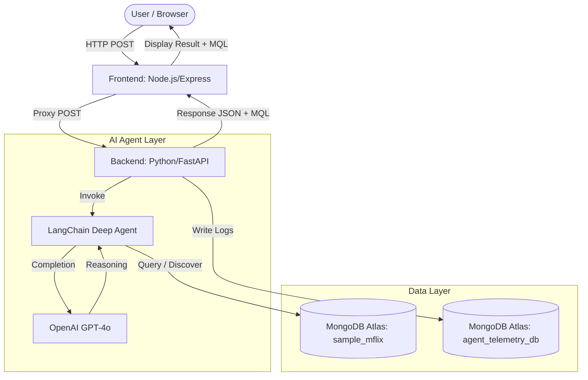

# MongoDB Deep Agent text to mql Application

This project is a full-stack, AI-powered chat application that translates natural language questions into MongoDB Query Language (MQL) and executes them against a database. 

It uses a microservices architecture, decoupling a powerful AI reasoning engine from a fast, lightweight frontend.

## Key Features
* **Natural Language to MQL:** Translates complex user questions into MongoDB aggregation pipelines.
* **MQL Transparency:** Displays the exact MQL query executed by the agent directly in the chat interface, providing transparency into how the answer was derived.
* **Automated Data Analysis:** Inspects database schemas and validates queries before execution.

## Architecture


* **Backend (Python / FastAPI):** Hosts a LangChain "Deep Agent" that connects to a MongoDB database. It handles schema inspection, query generation, validation, and execution.
* **Frontend (Node.js / Express):** A lightweight server serving a vanilla HTML/JS chat interface and proxying requests securely to the Python API.

## MongoDB Agent Toolkit
The backend utilizes the `langchain_mongodb.agent_toolkit` to empower the AI agent with direct database interaction capabilities. This toolkit provides a suite of specialized tools:

*   **`mongodb_list_collections`**: Allows the agent to discover available collections in the database.
*   **`mongodb_schema`**: Enables the agent to inspect the schema and sample documents of a specific collection to understand the data structure.
*   **`mongodb_query_checker`**: A validation tool that ensures the generated MQL syntax is correct before execution.
*   **`mongodb_query`**: The execution engine that runs the final aggregation pipeline against the operational database.

These tools work together in a structured workflow (Discovery -> Schema Understanding -> Query Generation -> Validation -> Execution) to ensure accurate and safe data retrieval.

## Setup Instructions

### 1. Prerequisites
Before you begin, ensure your system has the following installed:
* **Python 3.11+**: To run the LangChain AI backend.
* **Node.js 18+ and npm**: To run the Express chat server.
* **MongoDB Atlas Account**: You will need a cloud cluster with the official `sample_mflix` dataset loaded. ([Guide to loading sample data](https://www.mongodb.com/docs/atlas/sample-data/))
* **OpenAI API Key**: Required for the Deep Agent's LLM engine.

### 2. Configure the Backend (Python / AI Agent)
The backend requires its own isolated environment to prevent dependency conflicts.

1. Open a terminal and navigate to the `backend` directory:
   ```bash
   cd backend

2. Create a virtual environment and activate it:
    
    On macOS/Linux
    ```bash
        python3 -m venv dpmongo
        source dpmongo/bin/activate
    ```

    On Windows
    ```bash
        python -m venv dpmongo
        dpmongo\Scripts\activate
    ```

3. Install dependencies:
   ```bash
   pip install -r requirements.txt

4. Set up environment variables:
   ```bash
   cp .env.example .env
   # Edit .env to add your MongoDB Atlas credentials and OpenAI API key
   ```
   ```text
   # OpenAI configuration
   OPENAI_API_KEY="sk-proj-..."
   OPENAI_MODEL="gpt-4o" # Options: gpt-4o, gpt-4o-mini, etc.

   # MongoDB Atlas Connection
   # Replace <username> and <password> with your actual credentials
   MONGODB_URI="mongodb+srv://<username>:<password>@your-cluster.mongodb.net/?retryWrites=true&w=majority"
   OPERATIONAL_DB_NAME="sample_mflix"

   # Telemetry & Logging (For monitoring agent queries)
   LOG_DB_NAME="agent_telemetry_db"
   LOG_COLLECTION_NAME="chat_history_logs"
   ```
### 3.Configure the Frontend (Node.js / Chat UI)
The frontend serves the user interface and proxies requests to the Python API.
1. Open a new terminal window and navigate to the frontend directory:

    ```bash
    cd frontend
    ```
2. Install the necessary Node packages (Express and CORS):

    ```bash
    npm install
    ```

---

## Project Structure
We recommend organizing your files like this:
```text
deep-agents-text-to-mql/
│
├── backend/
│   ├── .env
│   ├── api.py
│   └── requirements.txt
│
└── frontend/
    ├── package.json
    ├── server.js
    └── public/
        └── index.html
```

## Running the Application

Because this application uses a microservices architecture, you will need to run both the backend and frontend servers concurrently. Open two separate terminal windows.

### Step 1: Start the AI Backend
1. In your first terminal (ensure your `venv` is still activated), navigate to the `backend` folder.
2. Start the FastAPI server:
   ```bash
   python api.py
   ```
3. **What to expect:** You will see the server boot up. Wait a few seconds until you see the terminal output `✅ Agent is ready and listening!`. The API is now actively running on `http://127.0.0.1:8000`.

### Step 2: Start the Web Frontend
1. In your second terminal, navigate to the `frontend` folder.
2. Start the Node.js server:
   ```bash
   node server.js
   ```
3. **What to expect:** You should see `🚀 Node.js Chat App running on http://localhost:3000`.

### Step 3: Start Chatting
1. Open your web browser and navigate to **[http://localhost:3000](http://localhost:3000)**.
2. You will see the MongoDB Agent Chat interface. 
3. Type a question about the `sample_mflix` database into the chat box!

**Example Queries to Try:**
* *"What are the top 5 highest-rated movies from the 1990s?"*
* *"Who is the most active commenter in the database?"*
* *"Give me a breakdown of the top 3 movie genres."*

---

## Troubleshooting
* **Agent responds with "Error: Could not get a response":** Ensure your Python backend is running and that your `.env` variables are correct. Check the Python terminal for specific error logs.
* **Port 8000 or 3000 is already in use:** You can change the port in `api.py` (for Python) or `server.js` (for Node) if another application is occupying them.